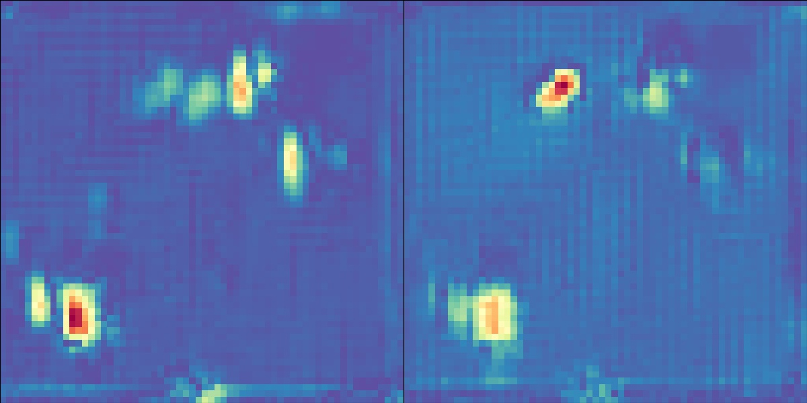
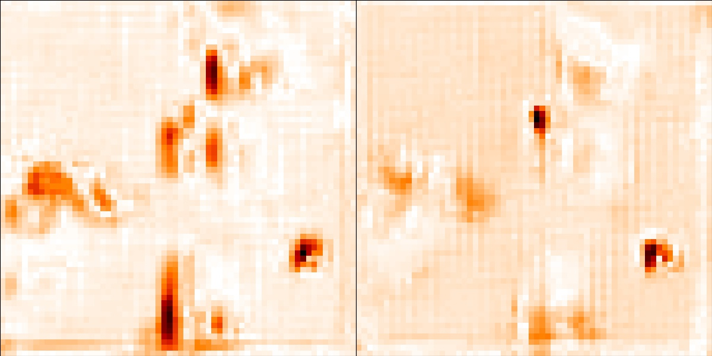
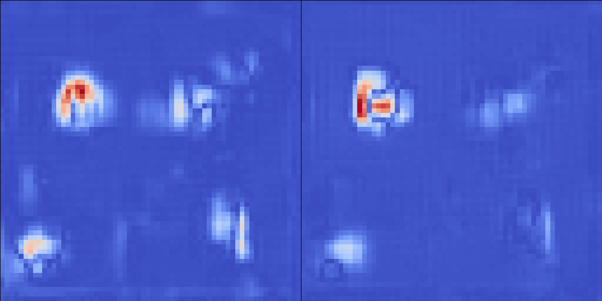
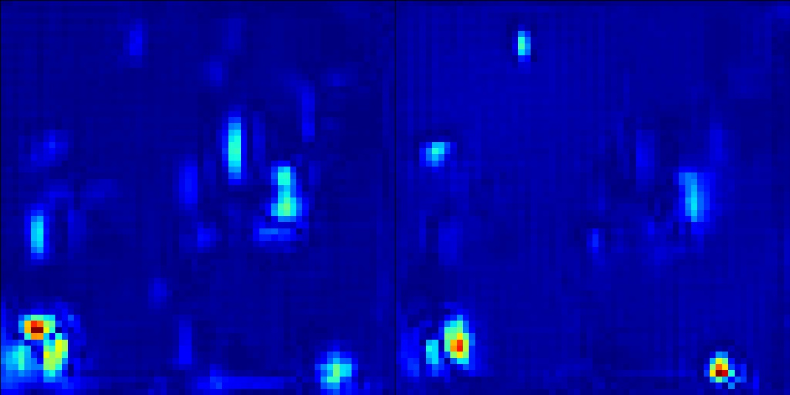

# Inner-Outlier Generator 

*Inner Outlier Generator (IO-GEN)* is designed to tackle 
One-class Classification (OC) problems by generating synthetic data 
that has a useful geographic property on the feature space of 
Deep Support Vector Data Description (DSVDD). 
This repo provides the official Tensorflow implementations of IO-GEN, which was first proposed in the paper: 

**"Identification of Abnormal States in Videos of Ants Undergoing Social Phase Change", Accepted to [IAAI-21](https://aaai.org/Conferences/AAAI-21/iaai-21-call/), (Pre-print version: https://arxiv.org/abs/2009.08626)**


Although theoretically, IO-GEN is applicable to any type of 
OC problems, here we focus on the exemplar scenario discussed in the above paper, where the classifier is trained only with observational samples from *stable* colony but has to distinguish *unstable* samples.
Instructions below start with a quick introduction to the pipeline of involved networks during training and test, followed by technical manuals to reproduce similar results to the paper. Ant motional data are also available at https://github.com/ctyeong/OpticalFlows_HsAnts.

# Contents 

1. [Model Pipeline](https://github.com/ctyeong/IO-GEN#model-pipeline)
2. [Installation](https://github.com/ctyeong/IO-GEN#installation)
3. [Training](https://github.com/ctyeong/IO-GEN#training)
3. [Test](https://github.com/ctyeong/IO-GEN#test)
4. [Exporting Fake Ant Motions](https://github.com/ctyeong/IO-GEN#exporting-fake-ant-motions)

# Model Pipeline
To better understand the code, we first review the pipeline of network model and data flows during training and test. 

## Training Steps

1. Deep Convolutional Autoencoder (DCAE) is trained. 
2. Encoder part of DCAE is fine-tuned as DSVDD.
3. IO-GEN is trained in an adversarial manner involving the feature space of DSVDD, which is frozen this time. 
   
   
4. Classifier is trained on top of frozen (IO-GEN, DSVDD).

   

## Structure for Test

(DSVDD, CLS) are the only components used after training to classify input optical flows as either stable or unstable. 

<!-- # SW/HW/Data Requirements
All codes here have been run with the following Python packages without issues:
- Python v3.6
- Tensorflow v2.1.0
- PIL v7.2.0
- Pandas v1.0.5

on a single NVIDIA TITAN XP graphics card (12GB) with the installation of NVIDIA Driver v440.100 (CUDA v10.2).
Moreover, users are encouraged to utilize optical flow data of ants at the following repo: https://github.com/ctyeong/OpticalFlows_HsAnts. -->

# Installation 

1. Clone the repository 
   ```
   git clone https://github.com/ctyeong/IO-GEN.git
   ```

2. Install the required Python packages
    ```
    pip install -r requirements.txt
    ```
    - Python 3.6 is assumed to be installed already

3. Download ant motional data
   ```
   cd IO-GEN
   git clone https://github.com/ctyeong/OpticalFlows_HsAnts.git
   mv split1 split2 split3 Stable Unstable ../ && cd ..
   rm -rf OpticalFlows_HsAnts
   ```
   
<!-- The following instruction assumes the input optical flows and at least one of the suggested splits have been downloaded from ["OpticalFlows_HsAnts"](https://github.com/ctyeong/OpticalFlows_HsAnts). That is, under the current directory, there are three folders such as:

`./Stable` 

`./Unstable` 

`./split1` 

For custom data, if the data hierarchy and a similar split format are given, the code here will require only few modifications. -->

# Training 

*train.py* is the core python script to train *DCAE, DSVDD, IO-GEN,* and *Classifier* in order. Each model is evaluated per epoch, and it is saved into a specified directory whenever the best performance has been achieved during epochs. Note that the numbers of epochs are set to 750, 160, 20K, and 40, respectively to follow the original protocol of the paper.

### With a particular data split 
Here is an example for training with *'split1'* in the current directory.
```
python train.py -s ./split1
```

*'-s'* argument must be provided although all other arguments, explained below, can be ignored just to run with default values.

### Specifying the number of optical flow pairs per input
The number of x,y optical flow pairs per input can be specified by *'-m'* (default=2): 
```
python train.py -s ./split1 -m 1
```

### Saving best models and training logs
The directories to store best trained models and [Tensorboard](https://www.tensorflow.org/tensorboard) logs can also be specified by *'-d'* and *'-t'*:
```
python train.py -s ./split1 -d ./saved_models -t ./tb_logs
```

Without specification, the directories are automatically set to *'./saved_models'* and *'./tb_logs'*, respectively. The best models are saved with names like *'DCAE.h5', 'DSVDD.h5', 'IO-GEN.h5',* and *'Classifier.h5'* under the corresponding directory.

<!-- Lastly, *'-v'* can be set either *1* or *0* to control the level of explanation during training (default=1).  -->

# Test

*test.py* is the python script to test the trained models: *'DCAE', 'DSVDD',* and *'IO-GEN'*. 

### Testing a particular model 
Any argument for training can be used for test as well. In addition, the model to test must be given with *'-n'* option. For example: 
```
$ python test.py -s ./split1 -d ./saved_models -n IO-GEN -m 4
```

This command will use *'split1'* to run the saved *'IO-GEN'* model located under *'./saved_models'* folder, which was trained with 4 optical flow pairs per input.

### AUC outputs
Each test execution prints out Area Under the Curve (AUC) scores of the Receiver Operating Characteristics (ROC) by applying the model in different time windows. For instance: 

```
D+1: .933
D+2: .943
D+3 - D+6: .909
D+7 - D+10: .792
D+11 - D+14: .688
D+15 - D+18: .678
All: .786
```

Similar to the report protocol in the paper, the first six rows indicate AUC scores at unique time bins while the colony is stabilized. 
In contrast, the last row is the performance measurement considering all samples from the entire observation period (D+1~D+18)

# Exporting Fake Ant Motions

*'synthesize.py'* is the python script to export synthetic optical flows of ants from trained *'IO-GEN'*. If you have saved the model at *'./save_models/IO-GEN.h5'* after training with 2 optical flows pairs per input of *'split1'*, the following command generates 5 fake optical flow pairs under *'./fake_imgs'*: 
```
python synthesize.py -s split1 -m 2 -p saved_models/IO-GEN.h5 -f ./fake_imgs -b 5 -c Spectral -i 1
```
*'-c'* option allows to specify a particular colormap ([among available choices](https://matplotlib.org/3.3.2/tutorials/colors/colormaps.html)), and *'-i'* inverses the order of pixel values in terms of magnitude, when set to 1, for better visualization with some colormaps.

Once the above has been executed, *'./fake_imgs'* contains: 
```
0.jpg, 1.jpg, 2.jpg, 3.jpg, 4.jpg
```
Note that each image file visualizes the horizontal and the vertical optical flows side-by-side. 

### Examples with different colormaps

Synthetic outputs from four different colormaps are displayed below. For each colormap, a pair of optical flows are exported side-by-side in an image file.

Spectral             |  gist_heat
:-------------------:|:--------------------:
 | 

coolwarm             |  jet
:-------------------:|:--------------------:
 | 

# Contact

If there is any question or suggestion, please do not hesitate to shoot an email to tchoi@lincoln.ac.uk. Thanks!


